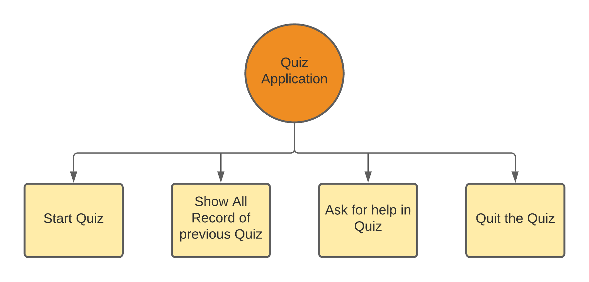
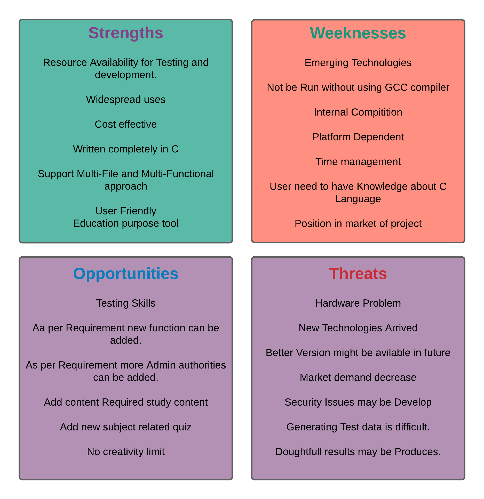

# Requirements
## Introduction
 A Quiz Application is a one type of education game in which user can apply for quiz for programing language like C and after
 attempting the quiz the can register there score to the data file and they can check the score of all the candidate whenever 
 they needed. There is one more feture like help to get the knownledge about how to play the quiz and what are the rules and
 regulations for quiz. i.e here In this project we are going to implement some calculator operations using C Language with a 
 Command Line Interface (CLI) where it can perform operations like :
 - Start Quiz 
 - Show the all Records
 - Get the Help regarding Quiz
 - Quit the Quiz

## Cost and Features
Cost and Features are depending upon the project and how well it is built how all the requirements will meet the cost and also 
it can be differ according to the trends of market.
- Start Quiz : The Quiz start using start_quiz(() function which not take any arguments as input and the function results in 
			   quiz started or not.
- Show all Results  : The all results shown using show_record() function which not takes any arguments as input and the function 
               		  results in fetch all record shown on CLI or not.
- Get help : Help is getting by using help() function which not takes any arguments as input and the function results in help data 
			 fully visible or not.
- Quit the quiz : The quiz has been quit by using exit(0) system function takes one argument as input and the function results in 
			 	  quiting task completed or not.
- Update Records : The records updated using edit_score() function takes two operand as input and the function results in record 
			 	   updation completed or not.

## Defining Our System
  **Architecture:**
  
   - Architecture
	
   
 - Quiz application is capable of performing following functions:
	 -  Starting Quiz
		 - Get Name 
		 - Give Answers
		 - Get Scores
		 - Submit Score or Re-Attempt Quiz
	-  Showing All Record
		 - Get details of all the Candidate Name as well as score
	-  Help to take quiz
		 - Get Details and term & condition on CLI
	-  Quiting the quiz
		 - Quit the quiz
	-  Edit Records
		 - Add the new Records
		 - Update Existing Candidate score
    

## SWOT ANALYSIS

   - SWOT Analysis
	

# 4W&#39;s and 1&#39;H

## Who:

- The project is used by all the candidate in day to day life. All the candidate who requires to check there knowledge on C programing 
  language will use the Application. The main objective of this project is the user should be get there knowledge idea with the help of 
  score and Suggestions.

## What:

- We can except the answers which candidate can give is in the form of A,B,C or D with relate given question.
- First three question to check the candidate be able to go furthure of need to geather more knowledge on C Programing.

## When:

- The project can be used when the Candidate want to self assess there knownledge and get the score for same and the score will be 
  obtained after completing all the questions.

## Where:

- In all the Functions it can be used and the project is portable and user-friendly, It should overcome all the drawbacks of the Old 
  existing system and most important of all meet the user requirements.

## How:

- The Project is going to be implemented in C language for the Both Windows & Linux OS
- The constraints of the project are to develop using industry standards with a multi-file approach.
- The Timeline of the project is 10 days.

# Detail requirements
## High Level Requirements:
|ID| Description |Category|status|
|--|------------|------|---------|
|H001 |A candidate should be able to start the quiz | Technical |Implemented
|H002 |A candidate should be able to get all records of candidates scores |Technical|Implemented
|H003 |A candidate should be able to get help for quiz |Technical|Implemented
|H004 |A candidate should be able to quit the quiz |Technical|Implemented

##  Low level Requirements:
|ID| Description |HLR ID | status|
|--|------------|------|---------|
|L001 |When Candidate press **' s '** or **' S '** key they able to start the quiz and enter there name |H001|Implemented
|L002 |When Candidate press **' y '** or **' Y '** key they can register there name and proceed furthure to take quiz |H001|Implemented
|L003 |When Candidate passes 3 question if they give 2 of right answer they process furthure by pressing **' y '** or **' Y '** key |H001|Implemented
|L004 |When Candidate take rest 7 question they get there score and press **' y '** or **' Y '** key they can reattempt the quiz |H001|Implemented
|L005 |When Candidate take rest 7 question they get there score and press **' n '** or **' N '** key they can register there score and proceed to the main menu |H001|Implemented
|L006 |When Candidate press **' v '** or **' V '** key they able to see the all records with name of candidate and score |H002|Implemented
|L007 |When Candidate press **' h '** or **' H '** key they able to see the helping instructions |H003|Implemented
|L008 |When Candidate press **' q '** or **' Q '** key they able to Quit the Game |H004|Implemented